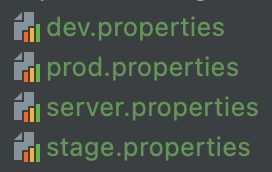

# Apply configuration to tests

> Purpose to test configuration applying

Java library to handle configuration [link](http://owner.aeonbits.org/)

[//]: # (TODO Need to specify different environments, maybe also demonstrate maven profiles)

## Best practice:
The best way to set up environment configuration is to create a separate property file for every environment



Read those environment properties with "owner" library, by creating Java interface:
```java
@Config.LoadPolicy(Config.LoadType.MERGE) // use merge policy to search every veriable from all available sources
@Config.Sources({
        "system:env", // use System key, convenient when need to test new created environment
        "system:properties", // use JVM properties, convenient in testing while reassigned some specific property
        "classpath:separate-configs/${env}.properties", // use predefined configs from specific file (dev, stage, prod) 
        "classpath:separate-configs/dev.properties" // default predefined config file will be used if nothing assigned
})
public interface ServerConfig extends Config {
    @Key("base.url") // if no default value, null will return
    String baseUrl();

    @DefaultValue("80") // if we don't provide default values, NPE will be raise
    int port();
}
```

With such approach we can re-assigned any property key via command line or specify specific key:
```bash
mvn clean test -Dtest=com.skryl.edu.TestDemonstration -Denv=prod
```
or
```bash
mvn clean test -Dtest=com.skryl.edu.TestDemonstration -Dbase.url=http://custom.env.ua
```
will print to std out:
```bash
[INFO] -------------------------------------------------------
[INFO]  T E S T S
[INFO] -------------------------------------------------------
[INFO] Running com.skryl.edu.TestDemonstration
Base url: http://custom.env.ua Port: 111
[INFO] Tests run: 1, Failures: 0, Errors: 0, Skipped: 0, Time elapsed: 0.087 s - in com.skryl.edu.TestDemonstration
```

## Maven profiles

[Official documentation](https://maven.apache.org/guides/introduction/introduction-to-profiles.html)

Instead of property files, can be used maven profiles, that can contain more sophisticated configuration.
- Configure variables:
```xml
<configuration>
    <environmentVariables>
        <env>prod</env>
    </environmentVariables>
</configuration>
```
- Configure different plugins
- Configure different properties
- Java version
etc...

## Native properties file for configuration

Read [config.properties](src/main/resources/config.properties) using [TestProperties.class](src/main/java/com/skryl/edu/utils/TestProperties.java)

Example of using in [TestPropertiesFile](src/test/java/com/skryl/edu/TestPropertiesFile.java)
