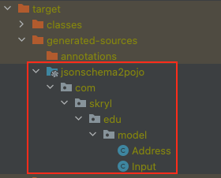
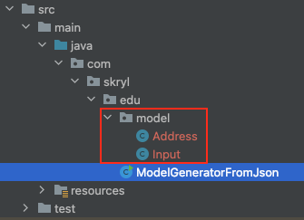

# Generating boilerplate code

> The purpose of that project is to define what code we can be generated without headache and complicity and bring to
> the project productivity, simplicity and remove human error

So, what we need to generate?

- Getter, Setter, etc... for working with Java objects
- HTTP API that have swagger or open api realisation
- Java models, POJOs from JSON or XML
- JSON schema from JSON to validate body response structure

## How to generate?

### Getter, Setter, etc... for working with Java objects

It's easy! Use [Lombok](https://projectlombok.org/) and all Stable feature that it provide. The most popular to use is
@Data annotation that provide @ToString, @EqualsAndHashCode, @Getter on all fields, and @Setter on all non-final fields,
and @RequiredArgsConstructor!.
Sometimes need to additionally customize @Data and add @NoArgsConstructor, @RequiredArgsConstructor and
@AllArgsConstructor.
@Log annotation is also often used, and it can be more specific, for example @Slf4j, @Log4j2.
I often used @Builder annotation, but now I'm more using experimental @Accessors annotation with chain=true, that allow
me to build object in fluent style.

### HTTP API that have swagger or open API realisation

This theme is quite complicated. There is a solution to build REST API Client from swagger or Open API, that described
in [wonderful tutorial](https://www.baeldung.com/spring-boot-rest-client-swagger-codegen) and it have two variants,
generate client project using CLI jar file or maven plugin, IMHO CLI is more stable and more easily to set up (due to
external dependencies). But overall this client has some major drawbacks:

- contains a lot, unnecessary and unknown dependencies
- the tool can fail with exception due to swagger JSON parsing (I had that issue, and I should have copied and pasted
  swagger JSON and fixed it)
- (critical) Client builds in such a way, that after request you got Java model (Pojo) and does not have access to HTTP
  response data, such as response code, headers, paths, etc...
- It took me more than one day to set up all the project, and run a test, and I still had authentication issues

Conclusion:
Long and unstable solution for a project that will be maintained on a daily basis, it can be useful for a new project,
just do some surface checking or like a separate module to simplify testing workflow. I will definitely continue with
that approach, but for now I won't use this tool for real project.

### Java models, POJOs from JSON or XML

Interesting approach that I will implement in that project, the plan will be:

- create JSON files or JSON schemas in resources that will represent REST API response body

- base on saved JSON or JSON schema, generate Java
  models ([Java Model generation](https://www.baeldung.com/java-generate-class-from-json)
  , [Github example](https://github.com/eugenp/tutorials/blob/master/json-2/src/main/java/com/baeldung/jsontojavaclass/JsonToJavaClassConversion.java)
  , [Maven plugin](https://github.com/joelittlejohn/jsonschema2pojo/wiki/Getting-Started#the-maven-plugin)
  , [Maven plugin configuration](http://joelittlejohn.github.io/jsonschema2pojo/site/1.1.2/generate-mojo.html))

 

- build REST API client (using [rest-assured](https://github.com/rest-assured/rest-assured/wiki/GettingStarted)) and
  testing response body (using [Wiremock](https://github.com/wiremock/wiremock)
  or [MockServer](https://github.com/mock-server/mockserver))
- Make a request and map response to generated Model and assert the value of the fields

Based on experience, the best way to use such approach is to use Maven plugin with custom configuration, and JSON schema
which can generate [on that site](https://jsonschema.net/) and fulfilled with business structured restriction, base
on [Understanding JSON Schema](https://json-schema.org/understanding-json-schema/index.html). JSON schema is best for
automation to make a sophisticated configuration for Java model generation and is also used to validate the response
structure. JSON file is great for Java model generation and also make a Mock for testing a service.

