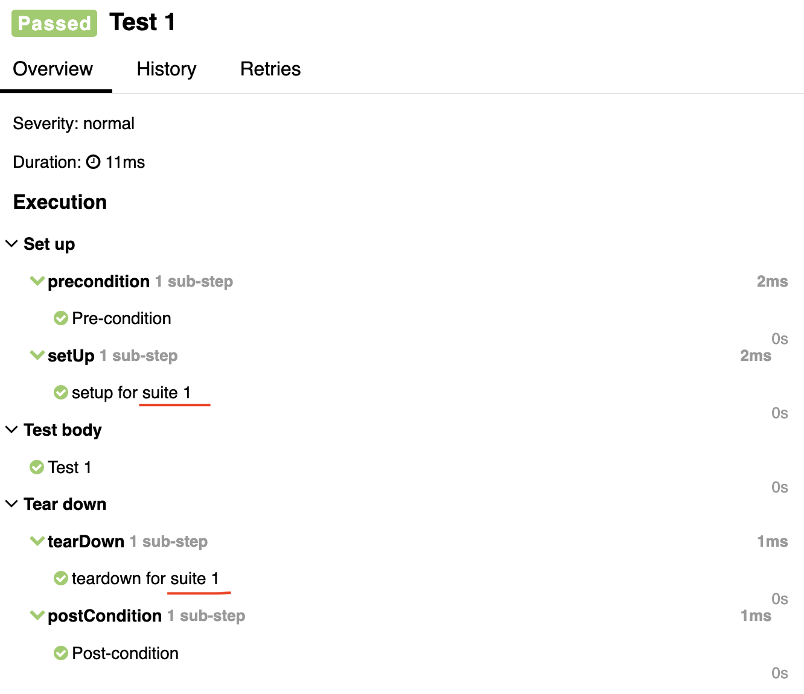
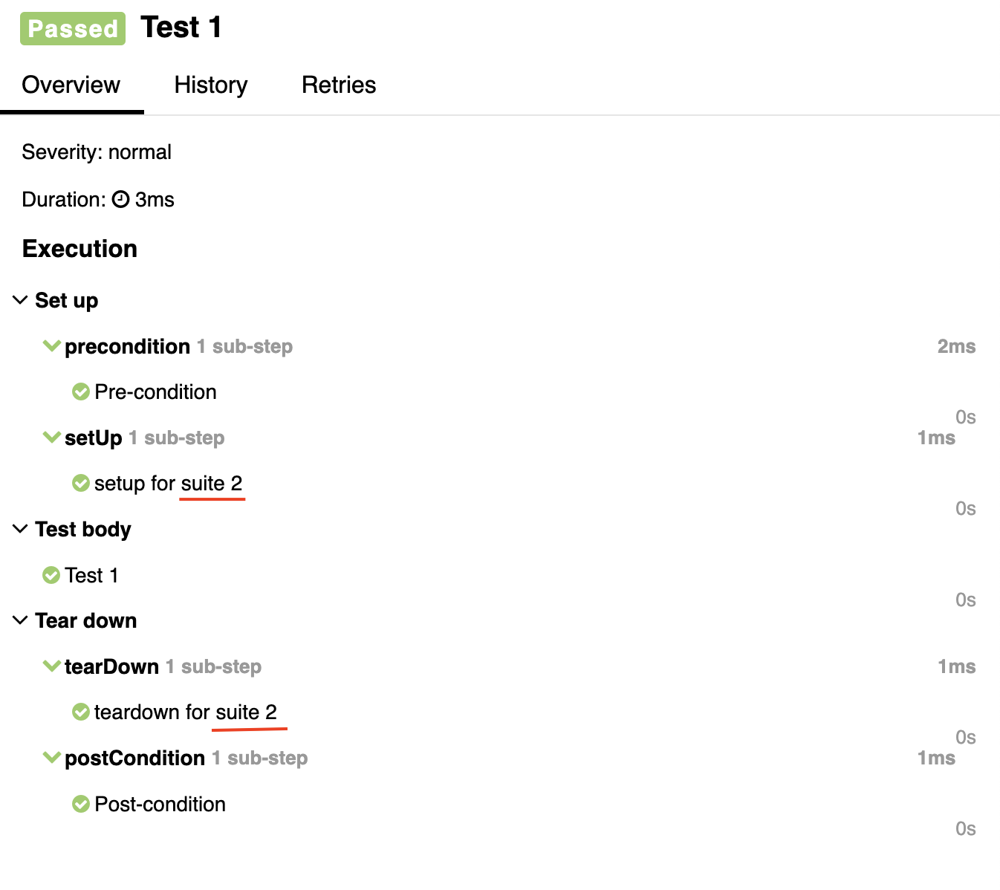

# Junit5 feature

> The goal is to provide examples of Junit5 features

Expired by [conference report](https://www.youtube.com/watch?v=DAszLeWMsqU&t=743s)

## Timeouts

The example of timeouts in tests, base on [article](https://howtodoinjava.com/junit5/timeout/)
Example: [TimeoutTests.java](src/test/java/com/skryl/edu/timeout/TimeoutTests.java)

## Nested

Problem: Sometimes for similar bunch of test need to different set up or tear down, let's look, can "nested" test help
to solve this issue?

Nested class with test is a great feature and can be used for similar functionality with on pre-condition,
post-condition (BeforeAll, AfterAll), but with different setup and teardown for every test (BeforeEach, AfterEach)

Example: [NestedTests.java](src/test/java/com/skryl/edu/nested/NestedTests.java)

AllureReport contains Pre,Post condition apply for both suite, but setup,teardown was specific for every
suite

|           Suite 1            |           Suite 2            |
|:----------------------------:|:----------------------------:|
|  |  |

